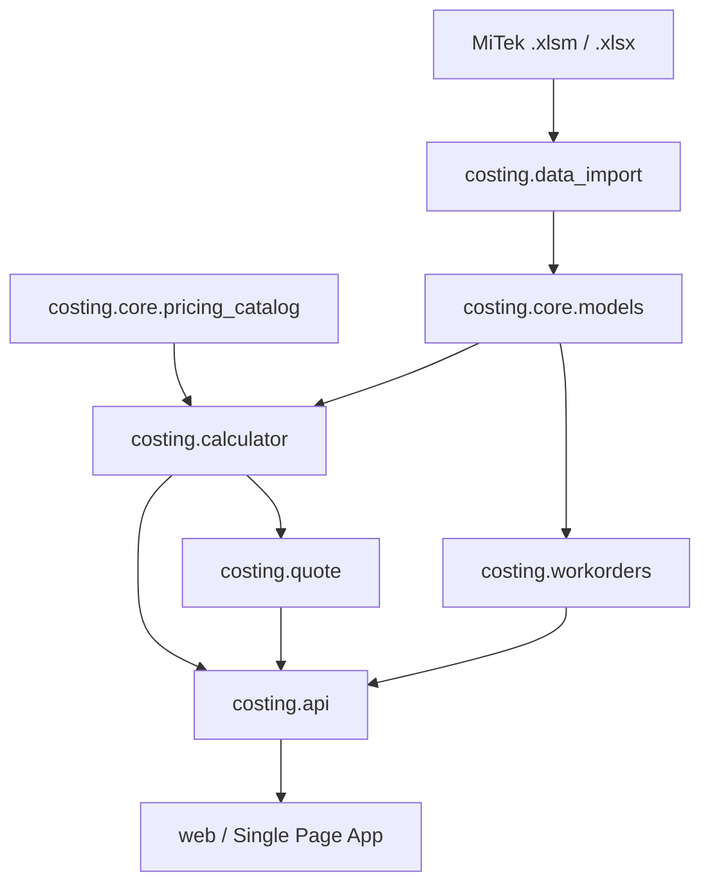

# Requirements

### Обзор и контекст
Исходный план `integrate-dk-pricing-policies-agents-vat.md` ставил задачу внедрения политик ценообразования компании «ДревКаркас», агентских вознаграждений, расчета НДС и P&L. В процессе разработки проект был полностью отрефакторен в чистую слоистую модульную архитектуру монорепозитория (`costing.*`, `web`, `docs`, `tests`, версия `0.1.0`).

### Аудит выполненного объема (100% Готово)
1. **Справочники политик ДК (`costing.core.pricing_catalog`)**:
   - Внедрены ставки на типы ферм (стандартные, с параллельными поясами, ножницы, полуфермы, стропила, балки перекрытия);
   - Встроены расценки на прирезку (4 000 ₽/м³), огнебиозащиту Сенеж (1 800 ₽/м²), проектирование КР (10 000 ₽ / 100 ₽/м²);
   - Зафиксированы профили клиентов (`standard`, `dealer`, `vip`) и агентские пресеты.
2. **Расчетное ядро себестоимости и P&L (`costing.calculator`)**:
   - Попозиционный расчет объема пиломатериала, площади МЗП, точек запрессовки;
   - Автоматический расчет 4-сторонней площади заготовок для защитной обработки;
   - Управление проектированием: режим `separate` (в КП) и `distributed` (пропорционально по позициям);
   - Расчет общей скидки (в % или фиксированной суммой);
   - Агентские вознаграждения строго после всех наценок и скидок в 3 режимах: `markup` (в плюс), `margin` (из маржи), `discount` (скидка заказчику);
   - Расчет произвольного % НДС;
   - Раздельный P&L: прибыль чисто от конструкций vs прибыль от дополнительных услуг vs чистая прибыль ДК.
3. **Оптимизация раскроя и наряды цеха (`costing.workorders`)**:
   - 1D Bin Packing оптимизатор раскроя заготовок на стандартные хлысты (6000 мм) с учетом ширины пропила (kerf);
   - Послойный расчет нарядов (`plies * qty`) для сборочного пресса.
4. **Коммерческие предложения (`costing.quote`)**:
   - Структурированная генерация КП с версионированием и формированием чистого HTML для печати.
5. **REST API & Архитектура (`costing.api`)**:
   - FastAPI сервис с модульными эндпоинтами (`/api/info`, `/api/sample`, `/api/upload`, `/api/costing/calculate`, `/api/positions/calculate`, `/api/cutting/optimize`, `/api/financials/calculate`, `/api/quote`, `/api/workorders`).
6. **Веб-интерфейс (SPA)**:
   - Модульный фронтенд (ES6) с 9 вкладками (Обзор, Позиции, Калькулятор, Раскрой, МЗП, Заготовки, P&L, Клиентское КП, Смета руководителя).
7. **Документация и тесты**:
   - Комплект документации в `docs/` (`ARCHITECTURE.md`, `ADR.md`, `PRICING_POLICY.md`, `PRODUCTION_GUIDE.md`, `API.md`);
   - 12 автоматизированных модульных тестов (`tests/test_*.py`).

### Что осталось не сделано / Требует доработки (Scope)
- **Входит в объем актуализации (In Scope)**:
  - **Интеграция производственных нарядов в UI**: добавление в интерфейс вкладки «Наряды цеха (Workorders)» с послойным отображением заданий сборки (`TSK-XXX`), точек запрессовки и ведомостей МЗП;
  - **Устранение дублирования статики**: консолидация файлов между `static/` и `web/static/` для поддержания единого источника фронтенда;
  - **Экспортные форматы**: добавление скачивания коммерческих предложений и карт раскроя в форматах HTML/CSV/Excel;
  - **Расширение тестов**: добавление тестов на многослойные пакеты ферм и граничные сценарии ценообразования.
- **Вне объема (Out of Scope)**:
  - Прямая интеграция с 1С Enterprise через SOAP/REST (остается на уровне экспорта данных);
  - Интеграция с физическими станками ЧПУ (формируются карты раскроя).

# Technical Design

### Текущее состояние архитектуры
Проект реализован как модульный пакет Python `costing` с разделением ответственности:



### Ключевые решения и планируемые доработки

1. **Добавление вкладки «Наряды цеха» в SPA-интерфейс**:
   - Создание модуля `web/static/js/modules/renderers/workorders.js`;
   - Вызов `POST /api/workorders` при расчете проекта;
   - Отображение интерактивной таблицы сборочных единиц: ID наряда (`TSK-001`), марка фермы, номер слоя из общего числа слоев, габариты (пролет, высота, уклон), количество точек запрессовки, объем древесины и площадь МЗП на слой.

2. **Очистка файловой структуры**:
   - Удаление дубликата папки `static/` в корне проекта;
   - Перевод всех статических ресурсов и шаблонов в директорию `web/` (`web/templates/index.html`, `web/static/js/`, `web/static/css/`);
   - Обновление монтирования в `costing/api/app.py`.

3. **Модули экспорта данных**:
   - Добавление функций выгрузки КП в HTML-файл для сохранения на диск;
   - Формирование CSV/Excel файлов карт раскроя (длины хлыстов, отходы, список заготовок).

### Структура файлов после актуализации
```text
costing/
  ├── core/                 # Модели, справочники политик ДК
  ├── data_import/          # Парсер MiTek Pamir
  ├── calculator/           # Расчет себестоимости, допов, скидок, P&L
  ├── quote/                # КП, печатные формы
  ├── workorders/           # Оптимизатор раскроя и наряды цеха
  └── api/                  # FastAPI роуты и схемы
web/
  ├── templates/
  │   └── index.html        # SPA интерфейс со всеми 10 вкладками
  └── static/
      ├── css/
      └── js/
          ├── app.js
          └── modules/
              ├── api.js
              ├── state.js
              ├── controllers.js
              └── renderers/
                  ├── workorders.js  # Новый рендерер нарядов
                  └── ...
docs/                       # Документация и регламенты
tests/                      # Автотесты
```

# Testing

### Подход к валидации
Валидация осуществляется через автоматизированные модульные тесты Python `unittest` и функциональные проверки веб-сервиса через `TestClient`.

### Ключевые сценарии проверки
1. **Послойная генерация нарядов**:
   - Проверка фермы с 2 слоями (`plies = 2`, `qty = 3`) — формирование ровно 6 сборочных задач `TSK-XXX` с правильным распределением объемов и пластин.
2. **Экспорт и печать**:
   - Проверка рендеринга HTML-формы КП и производственного наряда без искажения стилей и данных.
3. **Единая точка раздачи статики**:
   - Проверка загрузки всех ES6 модулей фронтенда из `web/static/` при удаленной корневой папке `static/`.
4. **Регрессионное тестирование ценообразования**:
   - Проверка сохранения результатов расчетов скидок, агентских схем и НДС на эталонном файле `Богородск 21 h1400 t40.xlsm`.

# Delivery Steps

### ✓ Step 1: Интеграция вкладки производственных нарядов (Workorders) в веб-интерфейс
В веб-интерфейсе появится отдельная вкладка для просмотра и печати послойных производственных нарядов (сборочные столы, точки запрессовки, карты раскроя).

- Добавить кнопку вкладки «Наряды цеха (Workorders)» и соответствующий контейнер `tab-workorders` в `web/templates/index.html`.
- Создать модуль рендеринга `web/static/js/modules/renderers/workorders.js` для отображения послойных заданий (`TSK-XXX`), пакетных данных (`qty x plies`) и точек запрессовки.
- Подключить вызов эндпоинта `POST /api/workorders` в `web/static/js/modules/controllers.js` и добавить экспорт на печать производственного наряда.

### ✓ Step 2: Консолидация статических ресурсов и шаблонов веб-интерфейса
В проекте устранено дублирование шаблонов и скриптов между корневой папкой `static/` и пакетом `web/`.

- Удалить избыточную копию `static/` в корне проекта в пользу единого источника `web/static/` и `web/templates/`.
- Обновить пути монтирования `StaticFiles` в `costing/api/app.py`, оставив строгую привязку к `web/static`.
- Проверить корректность отдачи SPA-интерфейса и статических ресурсов при запуске веб-сервера.

### ✓ Step 3: Расширение модулей экспорта КП и производственных данных (HTML / CSV / Excel)
Реализованы функции выгрузки коммерческих предложений и нарядов раскроя в форматы HTML/CSV/Excel.

- Добавить в `costing.quote.pdf_export` и `costing.api.routes` эндпоинты для скачивания готового HTML-документа КП (`GET /api/quote/download`).
- Реализовать генерацию CSV/Excel спецификаций раскроя и нарядов цеха для передачи операторам распиловочных станков и мастерам пресса.
- Добавить в интерфейс кнопки быстрого скачивания КП и производственных заданий.

### ✓ Step 4: Расширение набора автоматизированных тестов и валидация крайних случаев
Тестовый комплект покрывает все граничные случаи импорта, послойного расчета, агентских схем и API-эндпоинтов.

- Разработать тесты для проверки генератора производственных нарядов при многослойных пакетах ферм (`plies > 1`).
- Добавить тесты на валидацию некорректных входных данных (отсутствие листов в Excel, нулевые объемы, отрицательные скидки).
- Провести сквозное тестирование сценариев ценообразования через HTTP-клиент FastAPI `TestClient`.