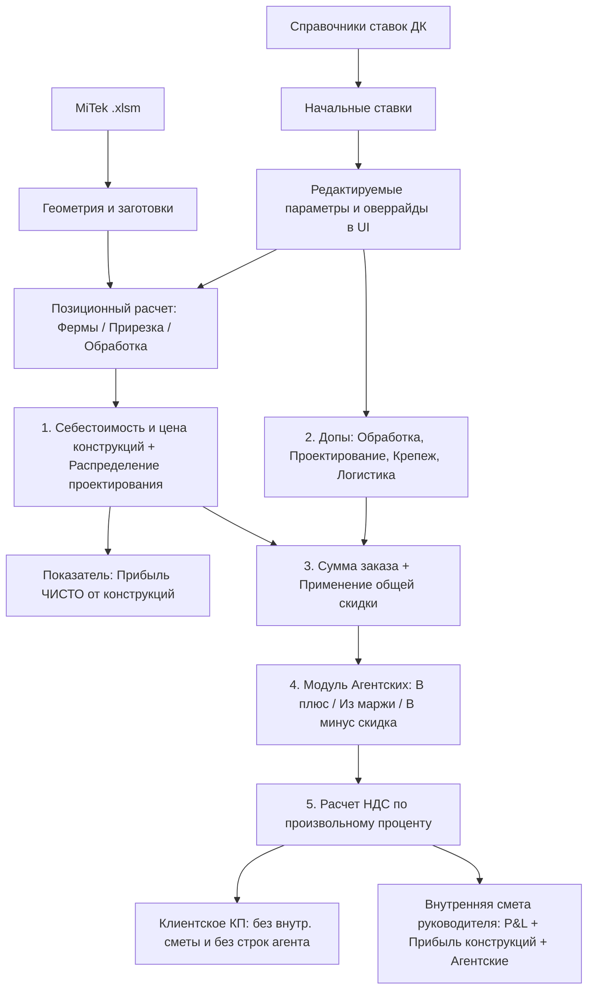

# Requirements

### Overview & Goals
Внедрить в веб-сервис систему автоматизированного и гибко настраиваемого ценообразования на основе регламента компании «ДревКаркас» (`Фермы - Политцен ДК.csv`). Система автоматизирует расчет себестоимости и отпускных цен с возможностью полного ручного переопределения любых параметров, учетом попозиционной обработки/прирезки, распределением проектирования, применением общей скидки, расчетом агентских комиссий (после всех наценок, скидок и допов), вводом произвольного % НДС и детальным расчетом прибыли чисто от конструкций (без допов).

### Scope
- **Входит в объем (In Scope):**
  - **Справочник политик ДК**: встроенные в код типовые ставки (типы ферм, прирезка, обработка СенежОгнеБио 300 г/м², проектирование, ступенчатая наценка от суммы, пресеты клиентов и агентов);
  - **Гибкость и редактируемость всех параметров**:
    - Все справочные наценки, ставки за м³/м² и надбавки подставляются автоматически при загрузке файла/выборе профиля, но остаются полностью редактируемыми пользователем в UI;
    - Все результаты авторасчета (себестоимость работ, проектирование, прирезка, обработка, надбавки) имеют возможность ручной корректировки (override);
  - **Попозиционное управление обработкой и прирезкой**:
    - Чекбоксы/селекторы включения/отключения защитной обработки (антисептирования) и прирезки для каждой конкретной позиции;
  - **Управление проектированием**:
    - Режим А: выделение отдельной строкой/услугой в КП;
    - Режим Б: пропорциональное распределение стоимости проектирования по выбранным позициям ферм/конструкций (без отдельной строки в КП);
  - **Общая скидка на заказ**:
    - Возможность задания общей скидки (в % или фиксированной суммой в рублях), применяемой после всех наценок и допов;
  - **Модуль агентских вознаграждений**:
    - Расчет агентских строго **после всех наценок, допов и общей скидки**;
    - Выбор агента из списка или ввод произвольного имени и %;
    - 3 режима применения:
      1. *«В плюс»* — надбавка сверху на сумму КП, выплачиваемая агенту;
      2. *«Из маржи / Не влияет на цену»* — сумма КП неизменна, комиссия агента вычитается из чистой прибыли ДК;
      3. *«В минус»* — скидка клиенту за счет агентского вознаграждения;
  - **Модуль НДС с прямым вводом процентов**:
    - Поле ввода произвольного процента НДС (0%, 20%, 5%, 7% и т.д.) с автоматическим расчетом суммы налога и цены с НДС;
  - **Раздельный финансовый анализ (P&L)**:
    - Вывод прибыли и маржинальности **чисто от конструкций** (фермы, балки, стропила) без учета дополнительных услуг;
    - Сводный финансовый результат: себестоимость, маржа от конструкций, маржа от допов, общие накладные, скидка, комиссия агента, чистая прибыль ДК;
  - **Печатные формы**:
    - Клиентское КП (чистое, без внутренней себестоимости и строк агентских комиссий, с корректным отображением проектирования и НДС);
    - Внутренняя смета руководителя (полная прозрачность P&L, прямых затрат, агентских выплат и прибыли).
- **Не входит в объем (Out of Scope):**
  - Динамический runtime-парсер CSV-файла на лету (нормативы встраиваются в Python-код в виде каталога);
  - Прямая интеграция с 1С (формируется модель данных и печатные формы).

### User Stories
- **Как менеджер/сметчик**, я хочу выбирать типовые пресеты и видеть авторасчет, но иметь возможность вручную изменить любую наценку, включить/выключить обработку и прирезку для отдельной фермы, чтобы гибко подстраивать КП под любые условия клиента.
- **Как сметчик**, я хочу выбирать способ учета проектирования (отдельной строкой или размазать по фермам), чтобы формировать КП в требуемом для заказчика формате.
- **Как менеджер по продажам**, я хочу задавать общую скидку и применять агентские комиссии строго после всех наценок и допов, чтобы точно рассчитывать финальную стоимость договора и сумму бонуса агента.
- **Как бухгалтер/руководитель**, я хочу вводить точный процент НДС и видеть прибыль компании чисто от производства конструкций отдельно от сопутствующих услуг (допов).

# Technical Design

### Current Implementation
Текущая версия `app.py` содержит базовый калькулятор себестоимости с едиными глобальными ставками и ручным вводом параметров для позиций. Нормативы ценообразования компании ДК зафиксированы в аналитическом документе `Фермы - Политцен ДК.csv`.

### Key Decisions
1. **Встроенный структурированный каталог политик с возможностью полного редактирования**:
   - Зафиксировать все расценки, ставки, профили клиентов и коэффициенты ДК в виде декларативных структур данных (`DK_PRICING_CATALOG`, `CLIENT_PROFILES`, `AGENTS_CATALOG`) внутри `app.py`.
   - Значения из справочников служат начальными значениями (defaults), подставляемыми при загрузке файла или выборе профиля, но любое поле (наценки %, ставки за м³, коэффициенты) доступно для редактирования пользователем.
   - Любое поле, вычисляемое автоматически (стоимость работ, проектирование, прирезка, антисептирование, надбавки), имеет режим ручной корректировки (override).

2. **Попозиционное управление операциями (прирезка и антисептирование)**:
   - В каждой строке спецификации конструкций добавляются флаги:
     - `has_treatment` (включить защитную обработку): расчет площади $S_{\text{обр}}$ только для выбранных позиций;
     - `has_cutting` (включить прирезку): расчет объема прирезки только для выбранных позиций.

3. **Логика учета проектирования**:
   - `design_mode`:
     - `separate`: проектирование идет отдельной строкой затрат и отдельной строкой в клиентском КП;
     - `distributed`: сумма проектирования распределяется по выбранным позициям (пропорционально объему $V_{\text{м³}}$), увеличивая отпускную цену конструкций без вывода отдельной строки в клиентском КП.

4. **Математическая последовательность расчета общей скидки, агентских и НДС**:
   - **Шаг 1. Прямая себестоимость и отпускная стоимость конструкций**:
     - $C_{\text{констр}} = \sum (\text{Себестоимость конструкций с учетом прирезки, МЗП и работ})$;
     - $P_{\text{констр}} = \sum (\text{Цена конструкций с учетом наценок и распределенного проектирования})$;
     - $\text{Маржа}_{\text{чисто\_констр}} = P_{\text{констр}} - C_{\text{констр}}$.
   - **Шаг 2. Дополнительные услуги (допы)**:
     - $C_{\text{допы}} = \text{Обработка} + \text{Проектирование}_{\text{отд}} + \text{Крепеж} + \text{Логистика}$;
     - $P_{\text{допы}} = C_{\text{допы}} \times (1 + \text{Наценка}_{\text{допов}})$.
   - **Шаг 3. Промежуточный итог и применение общей скидки**:
     - $P_{\text{subtotal}} = P_{\text{констр}} + P_{\text{допы}}$;
     - $P_{\text{after\_discount}} = P_{\text{subtotal}} - \text{Скидка}_{\text{руб}} \quad (\text{где Скидка может задаваться в \% или фиксированной суммой})$.
   - **Шаг 4. Расчет агентского вознаграждения (строго после всех наценок, допов и скидок)**:
     - При агентском проценте $A_{\%}$:
       - **Режим «В плюс» (Наценка)**: $P_{\text{client\_net}} = P_{\text{after\_discount}} \times (1 + A_{\%} / 100)$, $\text{Комиссия}_{\text{агента}} = P_{\text{after\_discount}} \times (A_{\%} / 100)$, маржа ДК сохраняется.
       - **Режим «Из маржи» (Не влияет на цену)**: $P_{\text{client\_net}} = P_{\text{after\_discount}}$, $\text{Комиссия}_{\text{агента}} = P_{\text{after\_discount}} \times (A_{\%} / 100)$, маржа ДК уменьшается на сумму комиссии.
       - **Режим «В минус» (Скидка заказчику)**: $P_{\text{client\_net}} = P_{\text{after\_discount}} \times (1 - A_{\%} / 100)$, $\text{Комиссия}_{\text{агента}} = 0$, скидка клиенту $= P_{\text{after\_discount}} \times (A_{\%} / 100)$.
   - **Шаг 5. Расчет НДС (ввод произвольного %)**:
     - При $\text{НДС}_{\%} = 0$: $P_{\text{final}} = P_{\text{client\_net}}$, $\text{Сумма}_{\text{НДС}} = 0$.
     - При $\text{НДС}_{\%} > 0$: $\text{Сумма}_{\text{НДС}} = P_{\text{client\_net}} \times (\text{НДС}_{\%} / 100)$, $P_{\text{final\_с\_НДС}} = P_{\text{client\_net}} + \text{Сумма}_{\text{НДС}}$.

5. **Финансовая аналитика (P&L и прибыль от конструкций)**:
   - В интерфейсе и внутренней смете выводятся 3 ключевых среза прибыли:
     1. **«Прибыль чисто от конструкций»**: $\text{Маржа}_{\text{чисто\_констр}} = P_{\text{констр}} - C_{\text{констр}}$ (показывает чистую эффективность производства ферм/стропил без искажения допами);
     2. **«Прибыль от дополнительных услуг»**: $\text{Маржа}_{\text{допы}} = P_{\text{допы}} - C_{\text{допы}}$;
     3. **«Итоговая чистая прибыль ДК»**: $\text{Маржа}_{\text{чисто\_констр}} + \text{Маржа}_{\text{допы}} - \text{Накладные} - \text{Скидка} - \text{Комиссия}_{\text{агента}}$ (при режиме «Из маржи»).

### Architecture Diagram

### Components & File Structure
- `app.py`:
  - `DK_PRICING_CATALOG`: декларативный справочник ставок ДК (типы ферм, прирезка, надбавки >12м, обработка, проектирование);
  - `CLIENT_PROFILES` и `AGENTS_CATALOG`: справочники контрагентов и базовых процентов;
  - `calculate_cost()`: расширенное расчетное ядро с попозиционным включением опций, распределением проектирования, скидкой, агентскими (3 режима), произвольным % НДС и выделением прибыли от конструкций;
  - `HTML_TEMPLATE`:
    - Интерактивная таблица позиций с чекбоксами «Обработка», «Прирезка», селектором «Тип конструкции» и полями ручной корректировки;
    - Панель параметров: выбор профиля клиента, ввод общей скидки (%, руб), переключатель проектирования (в КП / разнести по позициям), блок агентских (% и режим), поле ввода % НДС;
    - Аналитическая P&L карточка с выделением прибыли чисто от конструкций;
    - Клиентская печатная форма КП и форма внутренней сметы.
- `ADR.md` & `../AGENT.md`: фиксация архитектурных и математических правил ценообразования.

# Testing

### Validation Approach
Тестирование производится расчетным путем на эталонном проекте `Богородск 21 h1400 t40.xlsm` через вызовы API `/api/calculate` и валидацию рендеринга веб-интерфейса.

### Key Scenarios
1. **Проверка редактируемости и оверрайдов**:
   - Изменение базовых наценок и ручной ввод индивидуальных цен для ферм с проверкой сохранения пользовательских значений.
2. **Проверка попозиционной обработки и прирезки**:
   - Включение антисептирования только для фермы `2xТ1N` и отключение для стропил `СН1` — проверка изменения расчетной площади обработки и себестоимости.
3. **Проверка вариантов проектирования**:
   - Режим «Отдельной строкой»: строка «Проектирование» отображается в смете и КП;
   - Режим «Разнести по позициям»: строка проектирования отсутствует в КП, стоимость пропорционально вошла в стоимость позиций.
4. **Проверка общей скидки и агентских выплат**:
   - Задание скидки 50 000 ₽ на заказ;
   - Проверка расчета агентских 10% строго от остаточной суммы после скидки и допов во всех 3 режимах («В плюс», «Из маржи», «В минус»).
5. **Проверка произвольного % НДС**:
   - Расчет с 0%, 20%, 5% и 7% НДС, проверка корректности выделения налога.
6. **Проверка P&L и прибыли от конструкций**:
   - Сверка раздельного вывода: «Прибыль чисто от конструкций» vs «Общая прибыль с учетом допов».

# Plan

### ✓ Step 1: Интеграция справочников ценовых политик ДК и расчетного ядра себестоимости
- Внедрить декларативные структуры данных `DK_PRICING_CATALOG`, `CLIENT_PROFILES`, `AGENTS_CATALOG` в `app.py`.
- Реализовать попозиционный расчет себестоимости конструкций, прирезки, МЗП и защитной обработки.

### ✓ Step 2: Математический модуль агентских вознаграждений (3 режима), скидки и произвольного % НДС
- Реализовать логику распределения проектирования (отдельно / по позициям).
- Реализовать расчет общей скидки (%, сумма), 3 режимов агентских (в плюс, из маржи, скидка) и произвольного % НДС.
- Реализовать раздельный расчет прибыли чисто от конструкций и сводного P&L.

### * Step 3: Интерактивный UI с попозиционным управлением, пресетами, скидками, агентами и НДС
- Добавить выбор профилей клиентов, управление скидкой, агентскими (выбор/ввод %, выбор режима) и полем % НДС.
- Добавить переключатель режима проектирования.
- Обновить таблицу позиций с чекбоксами обработки/прирезки, типами конструкций и полями оверрайдов.

###   Step 4: Раздельная финансовая аналитика (P&L) и печатные формы (КП и смета)
- Добавить карточки и таблицы финансового анализа (прибыль чисто от конструкций vs общая маржа).
- Реализовать клиентскую печатную форму КП и внутреннюю смету руководителя.

###   Step 5: Комплексное тестирование и валидация ключевых сценариев
- Проверить расчеты через API `/api/calculate` и валидировать все 6 ключевых тестовых сценариев.