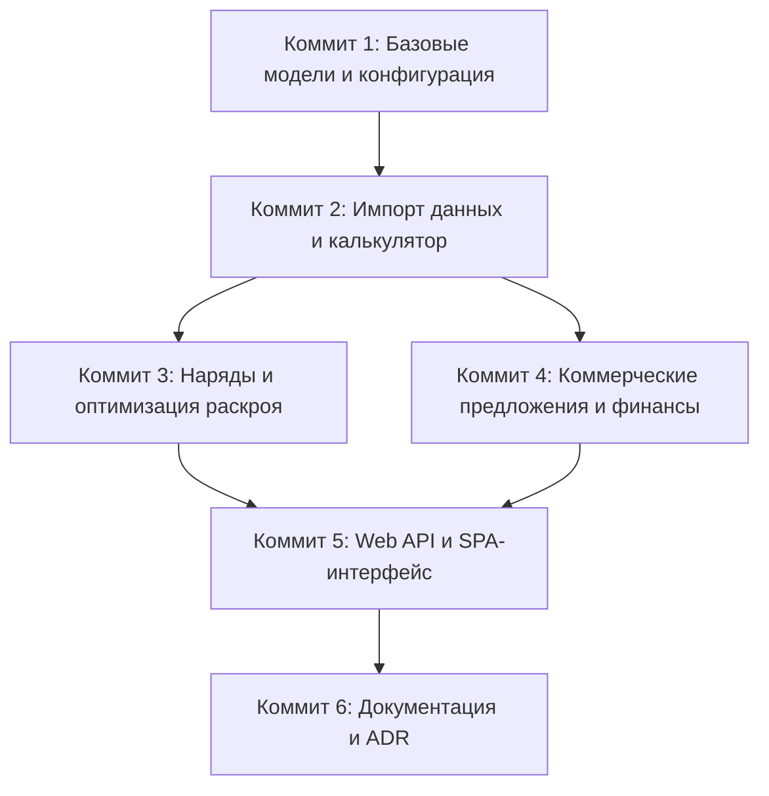

# Требования

### Цели и обзор
Цель задачи — разбить все текущие неотслеживаемые изменения в репозитории на последовательность атомарных, логически выверенных Git-коммитов. Послойное разделение кодовой базы максимизирует пользу при проведении код-ревью, обеспечивает надежную работу `git bisect`, сохраняет работоспособность тестов на каждом шаге и гарантирует прозрачную историю разработки.

### Границы проекта (Scope)
- **В рамках задачи:**
  - Группировка 64 неотслеживаемых файлов в 6 дискретных, логически упорядоченных коммитов.
  - Совместный коммит соответствующих модульных и интеграционных тестов вместе с их целевыми модулями.
  - Сохранение целостности кода и работоспособности тестов на каждом промежуточном коммите.
  - Использование формата Conventional Commits для стандартизации истории.
- **Вне рамок задачи:**
  - Изменение бизнес-логики или рефакторинг существующих алгоритмов.
  - Добавление сторонних зависимостей, отсутствующих в `pyproject.toml`.

### Функциональные требования
- **FR-1 (Атомарность):** Каждый коммит должен представлять собой замкнутую функциональную подсистему без оборванных или циклических импортов.
- **FR-2 (Иерархический порядок слоев):** Коммиты формируются по принципу снизу вверх (bottom-up): Инфраструктура и ядро -> Парсер и калькулятор -> Производственные наряды -> Коммерческие предложения и финансы -> Веб-сервис и интерфейс -> Документация.
- **FR-3 (Совместная верификация с тестами):** Тестовые модули коммитятся одновременно с тестируемой функциональностью для обеспечения максимальной надежности при отладке и локализации регрессий.
- **FR-4 (Чистое рабочее дерево):** После выполнения всех этапов рабочее дерево Git должно быть полностью чистым (`git status` не содержит неотслеживаемых или измененных файлов).

# Технический дизайн

### Текущее состояние
В репозитории находится 64 неотслеживаемых файла: базовые доменные модели, парсер выгрузок MiTek Pamir из Excel, расчетные движки себестоимости, 1D-оптимизатор раскроя пиломатериалов, генераторы КП и нарядов, бэкенд на FastAPI, SPA-фронтенд, наборы тестов и документация.

### Ключевые решения
- **Решение 1: Послойная стратегия снизу вверх (Bottom-Up)**: Начинаем с низкоуровневых структур данных и продвигаемся к API, UI и документации. Это исключает проблемы с зависимостями и нерабочими импортами на промежуточных коммитах.
- **Решение 2: Совместный коммит тестов с кодом**: Вместо выноса всех тестов в один общий финальный коммит, каждый файл `tests/test_*.py` включается в коммит соответствующей подсистемы. Это обеспечивает полную проверяемость каждого шага.
- **Решение 3: Формат сообщений Conventional Commits**: Использование стандартных префиксов (`feat(core):`, `feat(calc):`, `feat(workorders):`, `feat(quote):`, `feat(api):`, `docs:`) для автоматизации чейнджлогов и прозрачной навигации по истории.

### Последовательность коммитов и структура файлов

1. **`feat(core): initialize project structure and domain models`**
   - `.gitignore`
   - `pyproject.toml`
   - `uv.lock`
   - `costing/version.py`
   - `costing/__init__.py`
   - `costing/core/__init__.py`
   - `costing/core/models.py`
   - `costing/core/pricing_catalog.py`

2. **`feat(importer,calc): add MiTek parser and cost calculation engine`**
   - `costing/data_import/__init__.py`
   - `costing/data_import/base.py`
   - `costing/data_import/mitek_parser.py`
   - `costing/calculator/__init__.py`
   - `costing/calculator/timber.py`
   - `costing/calculator/plates.py`
   - `costing/calculator/services.py`
   - `costing/calculator/engine.py`
   - `tests/test_parser.py`
   - `tests/test_calculator.py`

3. **`feat(workorders): add 1D cutting optimizer and workorders generator`**
   - `costing/workorders/__init__.py`
   - `costing/workorders/models.py`
   - `costing/workorders/optimizer.py`
   - `costing/workorders/generator.py`
   - `tests/test_optimizer.py`
   - `tests/test_workorders.py`

4. **`feat(quote): implement commercial quotes engine and PDF export`**
   - `costing/quote/__init__.py`
   - `costing/quote/models.py`
   - `costing/quote/engine.py`
   - `costing/quote/pdf_export.py`
   - `tests/test_quote.py`

5. **`feat(web): add FastAPI web service, SPA frontend, and entrypoints`**
   - `costing/api/__init__.py`
   - `costing/api/schemas.py`
   - `costing/api/routes.py`
   - `costing/api/app.py`
   - `app.py`
   - `start_server.bat`
   - `web/templates/index.html`
   - `web/static/css/styles.css`
   - `web/static/js/app.js`
   - `web/static/js/modules/api.js`
   - `web/static/js/modules/controllers.js`
   - `web/static/js/modules/helpers.js`
   - `web/static/js/modules/state.js`
   - `web/static/js/modules/renderers/*.js`
   - `static/**`
   - `tests/test_api.py`

6. **`docs: add architecture documentation, guides, and README`**
   - `README.md`
   - `docs/ARCHITECTURE.md`
   - `docs/ADR.md`
   - `docs/PRICING_POLICY.md`
   - `docs/PRODUCTION_GUIDE.md`
   - `docs/API.md`
   - `.junie/AGENT.md`
   - `.junie/plans/integrate-dk-pricing-policies-agents-vat.md`

### Архитектурная схема зависимостей коммитов

# Тестирование

### Стратегия валидации
Автоматизированная проверка выполняется на каждом шаге для гарантии стабильности и работоспособности репозитория на протяжении всего процесса формирования коммитов.

### Ключевые сценарии проверки
- **Проверка работоспособности тестов**: Запуск `uv run python -m unittest discover tests` после добавления файлов каждого этапа для подтверждения прохождения тестов без регрессий.
- **Контроль состояния индекса**: Выполнение `git status` после каждого коммита для проверки того, что добавлены исключительно целевые файлы.
- **Итоговая верификация дерева**: Проверка чистоты рабочего дерева (`git status --porcelain` возвращает пустой вывод) и целостности истории (`git log --oneline`).

### Краевые случаи
- **Статические ресурсы**: Обеспечить корректное включение файлов интерфейса из `web/` и вспомогательных файлов из `static/` без пропущенных ссылок.
- **Целостность импортов**: Проверить, что верхнеуровневые точки входа (например, `app.py`) корректно импортируют все модули пакета `costing`.

# Delivery Steps

### ✓ Step 1: Инфраструктура проекта и базовые доменные модели
Инициализирована инфраструктура репозитория, зависимости проекта и ключевые структуры данных доменной модели.

- Добавить в индекс и закоммитить `.gitignore`, `pyproject.toml`, `uv.lock` и `costing/version.py`.
- Добавить `costing/__init__.py`, `costing/core/__init__.py`, `costing/core/models.py` и `costing/core/pricing_catalog.py`.
- Зафиксировать базовые модели пиломатериалов, пластин МЗП, позиций ферм и справочники ценообразования.
- Проверить корректность структуры пакета и импортов.

### ✓ Step 2: Парсер MiTek и расчетный модуль себестоимости с тестами
Реализован парсер выгрузок MiTek Pamir из Excel и расчет прямых затрат с комплектом тестов.

- Добавить в индекс и закоммитить `costing/data_import/__init__.py`, `costing/data_import/base.py` и `costing/data_import/mitek_parser.py`.
- Добавить в индекс и закоммитить `costing/calculator/__init__.py`, `costing/calculator/timber.py`, `costing/calculator/plates.py`, `costing/calculator/services.py` и `costing/calculator/engine.py`.
- Добавить модульные тесты `tests/test_parser.py` и `tests/test_calculator.py`.
- Запустить тесты парсера и калькулятора, подтвердив соответствие расчетов ценовому каталогу.

### ✓ Step 3: Генератор производственных нарядов и оптимизатор раскроя с тестами
Реализован 1D-оптимизатор раскроя пиломатериалов и генератор нарядов для цеха с тестами.

- Добавить в индекс и закоммитить `costing/workorders/__init__.py`, `costing/workorders/models.py`, `costing/workorders/optimizer.py` и `costing/workorders/generator.py`.
- Добавить модульные тесты `tests/test_optimizer.py` и `tests/test_workorders.py`.
- Проверить многослойный пересчет ферм, 1D bin-packing раскрой и генерацию производственных заданий.

### ✓ Step 4: Движок коммерческих предложений, финансовые политики и экспорт PDF с тестами
Реализовано управление коммерческими предложениями, расчет маржи/наценок, агентских комиссий, НДС и генерация PDF с тестами.

- Добавить в индекс и закоммитить `costing/quote/__init__.py`, `costing/quote/models.py`, `costing/quote/engine.py` и `costing/quote/pdf_export.py`.
- Добавить набор тестов `tests/test_quote.py`.
- Проверить расчет НДС, агентских комиссий/скидок, версионирование КП и экспорт в PDF.

### ✓ Step 5: FastAPI бэкенд, веб-интерфейс SPA и тесты API
Развернуты эндпоинты REST API, подключен веб-интерфейс SPA и точки запуска приложения с интеграционными тестами.

- Добавить в индекс и закоммитить `costing/api/__init__.py`, `costing/api/schemas.py`, `costing/api/routes.py` и `costing/api/app.py`.
- Добавить в индекс и закоммитить точки входа `app.py` и `start_server.bat`.
- Добавить файлы веб-интерфейса в `web/` и статические ресурсы в `static/`.
- Добавить интеграционные тесты API в `tests/test_api.py` и проверить все эндпоинты (`/api/sample`, `/api/upload`, `/api/calculate`, `/api/quote`, `/api/workorders`).

### ✓ Step 6: Техническая документация и архитектурные регламенты
Добавлена документация по архитектуре системы, инженерные регламенты, спецификации ценообразования и README репозитория.

- Добавить в индекс и закоммитить `README.md`.
- Добавить документацию в `docs/` (`docs/ARCHITECTURE.md`, `docs/ADR.md`, `docs/PRICING_POLICY.md`, `docs/PRODUCTION_GUIDE.md`, `docs/API.md`).
- Добавить руководства по разработке в `.junie/`.
- Проверить историю коммитов (`git log`) и убедиться в полной чистоте рабочего дерева.