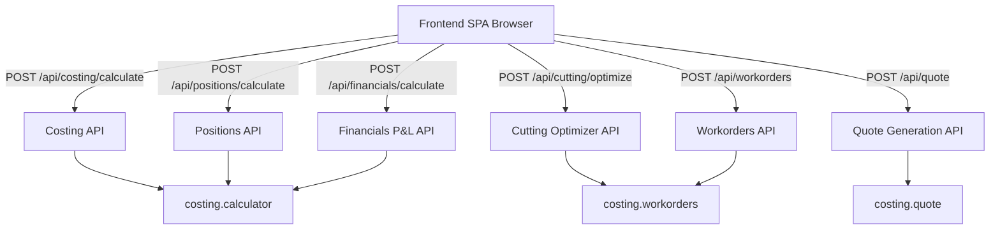

# Requirements

### Overview & Goals
Цель задачи — актуализировать ключевую проектную документацию (`.junie/AGENT.md`, `docs/ADR.md` и `docs/ARCHITECTURE.md`), отразив недавние архитектурные преобразования системы:
1. Модульную декомпозицию клиентской части на чистые ES6-модули (`state.js`, `api.js`, `helpers.js`, `controllers.js`, `renderers/`).
2. Разделение монолитного эндпоинта `POST /api/calculate` на гранулярные REST API маршруты (`/api/costing/calculate`, `/api/positions/calculate`, `/api/cutting/optimize`, `/api/financials/calculate`) для целевого логирования и мониторинга метрик.

### Scope
- **In Scope:**
  - Обновление `.junie/AGENT.md` (актуализация структуры проекта, описание пакетов `costing/`, перечня эндпоинтов, инструкций по валидации через `unittest`).
  - Добавление новых архитектурных решений в `docs/ADR.md` (ADR-009 по No-Build ES6 модулям и ADR-010 по декомпозиции API-эндпоинтов для метрик и логирования).
  - Актуализация диаграммы слоев и структуры файлов в `docs/ARCHITECTURE.md`.
- **Out of Scope:**
  - Изменение программного кода бэкенда или фронтенда (все изменения в коде уже реализованы и протестированы).

### User Stories
- **Как разработчик / AI-агент**, я хочу видеть в `.junie/AGENT.md` точную структуру модульного пакета `costing/` и правила работы с ES6-модулями, чтобы быстро ориентироваться в кодовой базе и не вносить регрессий.
- **Как архитектор / инженер**, я хочу иметь в `docs/ADR.md` зафиксированные решения ADR-009 и ADR-010, чтобы понимать мотивацию и последствия разделения эндпоинтов и модульности фронтенда.

# Technical Design

### Current Implementation
- В `.junie/AGENT.md` описана устаревшая структура, в которой `app.py` фигурирует как единственный монолитный файл, содержащий парсер, оптимизатор и HTML-шаблон. Также указана старая команда проверки вместо вызова набора тестов `tests/test_*.py`.
- В `docs/ADR.md` зафиксированы решения с ADR-001 по ADR-008. Не зафиксированы последние решения о No-Build ES6-модульности фронтенда и разделении API-эндпоинтов по доменам.
- В `docs/ARCHITECTURE.md` файловая структура в секции `web/static/js/` не раскрывает внутреннее устройство подпапки `modules/`.

### Key Decisions
1. **Фиксация ADR-009 (No-Build ES6 Modules):**
   - *Контекст:* Монолитный JS в 500+ строк усложнял сопровождение интерфейса.
   - *Решение:* Декомпозиция на модули (`state.js`, `api.js`, `helpers.js`, `controllers.js`, `renderers/*.js`) со связыванием через `<script type="module">` без внешних бандлеров (npm/Vite/Webpack).
2. **Фиксация ADR-010 (Granular Domain API Endpoints):**
   - *Контекст:* Единый `POST /api/calculate` затруднял аудит, детальное логирование нагрузки по вкладкам и расчет раздельных метрик.
   - *Решение:* Выделение специализированных эндпоинтов `/api/costing/calculate`, `/api/positions/calculate`, `/api/cutting/optimize`, `/api/financials/calculate` с сохранением `POST /api/calculate` для обратной совместимости.
3. **Обновление .junie/AGENT.md:**
   - Приведение секций 2, 5 и 6 в соответствие с реальным состоянием репозитория и стандартами тестирования (`uv run python -m unittest discover tests`).

### File Structure
- `.junie/AGENT.md` — обновление секций структуры проекта, архитектурных правил и верификации.
- `docs/ADR.md` — добавление ADR-009 и ADR-010, обновление оглавления.
- `docs/ARCHITECTURE.md` — синхронизация описания каталогов `web/static/js/modules/` и списка REST-эндпоинтов.

### Architecture Diagram


# Testing

### Validation Approach
- Проверить форматирование Markdown и корректность внутренних якорных ссылок в оглавлении `docs/ADR.md`.
- Проверить соответствие путей и названий модулей в `.junie/AGENT.md` реальной структуре репозитория (`costing/`, `web/static/js/modules/`, `tests/`).
- Запустить автоматический тестовый набор проекта для подтверждения целостности системы:
  ```bash
  uv run python -m unittest discover tests
  ```

# Delivery Steps

### ✓ Step 1: Синхронизация и актуализация .junie/AGENT.md
Актуализировать инструкцию для разработчиков и AI-агентов `.junie/AGENT.md`:
- Заменить устаревшую структуру монолитного файла `app.py` на актуальную многослойную архитектуру пакета `costing/` (`core`, `data_import`, `calculator`, `quote`, `workorders`, `api`).
- Описать структуру фронтенд-модулей ES6 (`state.js`, `api.js`, `helpers.js`, `controllers.js`, `renderers/`).
- Добавить спецификацию новых специализированных REST API маршрутов (`/api/costing/calculate`, `/api/positions/calculate`, `/api/cutting/optimize`, `/api/financials/calculate`).
- Обновить команду автоматической верификации на запуск тестов через `uv run python -m unittest discover tests`.

### ✓ Step 2: Фиксация ADR-009 и ADR-010 в docs/ADR.md
Зафиксировать новые архитектурные решения в `docs/ADR.md`:
- Добавить **ADR-009: Модульная декомпозиция фронтенда на ES6-модули без внешних бандлеров (Vanilla ES6 Modules / No-Build SPA)** — описание разделения UI-логики на слои состояния, сетевых вызовов, диспетчеризации и рендереров без усложнения среды сборки.
- Добавить **ADR-010: Разделение API-эндпоинтов по доменам и вкладкам для гранулярного логирования и метрик** — фиксация перехода от монолитного `POST /api/calculate` к таргетированным эндпоинтам по сервисам/вкладкам с сохранением обратной совместимости.
- Обновить оглавление `docs/ADR.md` ссылками на новые разделы.

### ✓ Step 3: Синхронизация docs/ARCHITECTURE.md
Актуализировать общую схему архитектуры в `docs/ARCHITECTURE.md`:
- Обновить дерево каталогов `web/static/js/` и `costing/api/routes.py` с учетом модулей и выделенных эндпоинтов.
- Отразить потоки данных между UI-контроллерами и новыми доменными эндпоинтами.