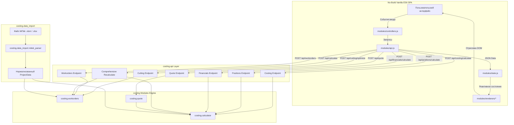

# Архитектура программного комплекса MiTek Costing & Production Suite

Модульный монорепозиторий инженерно-экономических расчетов деревянных ферм на металлических зубчатых пластинах (МЗП) на основе данных САПР **MiTek Pamir**.

---

### 1. Обзор слоев и модулей (Layers & Modules)

```
truss-quote-production/
│
├── costing/                    # ОСНОВНОЙ ПАКЕТ / МОНОРЕПОЗИТОРИЙ
│   ├── core/                   # Базовые сущности, модели данных и справочники ценовых политик
│   │   ├── models.py           # Доменные структуры (TrussFrame, TimberItem, PlateItem, etc.)
│   │   ├── pricing_catalog.py  # Справочники ДК, клиентские профили, агентские ставки
│   │   └── settings.py         # Пользовательские настройки и алиасы (settings.json)
│   │
│   ├── data_import/ (importers)# СЛОЙ ИМПОРТА ДАННЫХ
│   │   ├── base.py             # Базовый абстрактный интерфейс импортеров
│   │   └── mitek_parser.py     # Парсер выгрузок MiTek Pamir (.xlsm / .xlsx)
│   │
│   ├── calculator/             # РАСЧЕТНЫЙ МОДУЛЬ (CALCULATOR LAYER)
│   │   ├── engine.py           # Ядро расчета себестоимости и попозиционного ценообразования
│   │   ├── timber.py           # Расчет объемов древесины, запаса, 4-сторонней площади
│   │   ├── plates.py           # Расчет площади и стоимости пластин МЗП в м²
│   │   └── services.py         # Расчет антисептирования, проектирования, логистики, накладных
│   │
│   ├── quote/                  # КОММЕРЧЕСКИЕ ПРЕДЛОЖЕНИЯ И ВЕРСИИ (QUOTE LAYER)
│   │   ├── engine.py           # Генератор КП, учет скидок, расчет агентских и НДС
│   │   ├── models.py           # Модели версий КП, статусы согласования
│   │   └── pdf_export.py       # Генерация печатных HTML/PDF представлений
│   │
│   ├── workorders/             # ПРОИЗВОДСТВЕННЫЙ МОДУЛЬ (WORKORDERS LAYER)
│   │   ├── optimizer.py        # 1D Bin Packing оптимизатор раскроя пиломатериала
│   │   ├── generator.py        # Генератор сборочных нарядов (послойный учет) и ведомостей МЗП
│   │   └── models.py           # Модели производственных заданий и раскладок
│   │
│   └── api/                    # BACKEND API (FASTAPI)
│       ├── app.py              # Инициализация приложения, маршруты / и /admin, раздача статики
│       ├── routes.py           # REST маршруты:
│       │                       #  - /api/info, /api/sample, /api/upload
│       │                       #  - /api/costing/calculate, /api/positions/calculate
│       │                       #  - /api/cutting/optimize, /api/financials/calculate
│       │                       #  - /api/calculate, /api/quote, /api/workorders
│       │                       #  - /api/admin/type-aliases (GET/PUT)
│       └── schemas.py          # Pydantic схемы валидации
│
├── web/                        # WEB-ИНТЕРФЕЙС (NO-BUILD SPA FRONTEND)
│   ├── templates/              # HTML-шаблоны страниц
│   │   ├── index.html          # Главная интерактивная страница (боковое меню + 5 блоков)
│   │   └── admin.html          # Панель администрирования настроек и алиасов
│   └── static/                 # Статические ресурсы
│       ├── css/styles.css      # Стили TailwindCSS, кастомные скроллбары и правила печати
│       └── js/                 # Модульная клиентская архитектура (ES6)
│           ├── app.js          # Точка входа и инициализация приложения
│           └── modules/        # Модули SPA:
│               ├── state.js    # Хранилище реактивного состояния (appState)
│               ├── api.js      # Сетевой слой асинхронных вызовов REST API
│               ├── helpers.js  # Вспомогательные UI функции (форматирование, лоадер)
│               ├── controllers.js # Диспетчеры событий, переключение вкладок и сайдбара
│               ├── ifc-viewer.js  # 3D IFC Viewer (Three.js / Web-IFC / OrbitControls)
│               └── renderers/  # Доменные рендереры интерфейса
│                   ├── summary.js    # Сводка и геометрия (с поддержкой алиасов)
│                   ├── positions.js  # Позиции и сложность
│                   ├── costing.js    # Себестоимость и материалы
│                   ├── cutting.js    # Карты раскроя хлыстов
│                   ├── specs.js      # Спецификации доски и МЗП
│                   ├── financials.js # P&L управленческий отчет
│                   ├── quotes.js     # Коммерческое предложение
│                   └── index.js      # Единый фасад рендереров
│
├── docs/                       # ДОКУМЕНТАЦИЯ, РЕГЛАМЕНТЫ, СХЕМЫ
│   ├── ARCHITECTURE.md         # Описание архитектуры слоев и потоков данных
│   ├── ADR.md                  # Реестр архитектурных решений (Architecture Decision Records)
│   ├── PRICING_POLICY.md       # Регламент ценообразования ДК, расчет наценок, агентов и НДС
│   ├── PRODUCTION_GUIDE.md     # Производственный регламент, раскрой и послойный сбор
│   └── API.md                  # Документация REST API
│
├── tests/                      # АВТОМАТИЗИРОВАННЫЕ ТЕСТЫ
├── app.py                      # Единая точка запуска приложения
├── settings.json               # Пользовательские настройки (алиасы типов конструкций)
├── start_server.bat            # Скрипт быстрого запуска в 1 клик на Windows
└── pyproject.toml              # Конфигурация проекта и зависимостей
```

---

### 2. Потоки данных (Data Flow Diagram)



---

### 3. Принципы изоляции и связности слоев

3.1. **Модульность бэкенда:** Каждый подпакет в `costing/` выполняет строго одну зону ответственности (Single Responsibility).
3.2. **Отсутствие круговых зависимостей:** `calculator`, `workorders`, `quote` и `data_import` зависят только от `core` и стандартных библиотек. `api` объединяет функционал всех модулей.
3.3. **Чистая граница API:** Все входящие запросы валидируются через схемы `costing.api.schemas.py`.
3.4. **Гранулярные доменные эндпоинты:** Разделение маршрутов API по функциональным зонам (`costing`, `positions`, `cutting`, `financials`) обеспечивает детальное логирование, сбор целевых метрик и снижает вычислительную нагрузку.
3.5. **No-Build Vanilla ES6 Frontend:** Интерфейс построен по принципу SPA на чистых ES6-модулях браузера без необходимости сборщиков (Webpack/Vite/npm), разделен на слои состояния (`state.js`), сети (`api.js`), диспетчеризации (`controllers.js`), 3D-визуализации (`ifc-viewer.js`) и отображения (`renderers/`).
3.6. **Эргономика боковой навигации (Sidebar):** Элементы управления сгруппированы по 5 целевым блокам (`Продажи`, `Производство`, `Внутренние расчеты`, `IFC Обзор`, `Настройки`) с поддержкой мобильной шторки и верхнего бара активного проекта, что обеспечивает удобство работы различных специалистов предприятия.
